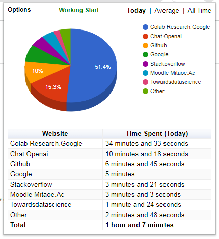
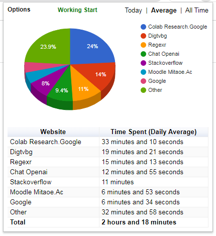
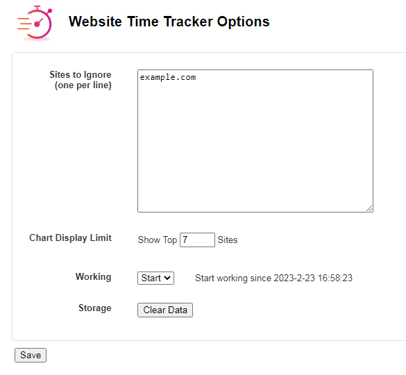

# Website Time Tracker Chrome Extension

The Website Time Tracker Chrome Extension is a tool designed to help users keep track of how much time they spend on various websites. With this extension, users can monitor their browsing habits and identify areas where they may be wasting time.

## Features

- Tracks the amount of time spent on websites
- Displays statistics on the user's browsing habits
- Customizable settings to fit the user's preferences

## Installation

To install the Website Time Tracker Chrome Extension, follow these steps:

1. Download the extension from the Chrome Web Store.
2. Click on the "Add to Chrome" button.
3. A pop-up will appear asking you to confirm the installation. Click "Add Extension".
4. The extension will now be installed and ready to use.

## Usage

To use the extension, simply browse the internet as you normally would. The extension will automatically track the time you spend on each website and display the information in the extension's dashboard.

The dashboard will show you which websites you spend the most time on, and how much time you spend on them on average. You can also customize the settings to stop and start tracking as per your wish.

## Customization

The Website Time Tracker Chrome Extension allows users to customize various settings to fit their preferences. These settings include:

- Blacklist: Choose which websites you don't want to track.
- Display Limit settings: Choose when and how often you want to receive notifications.
- Dashboard settings: Choose which statistics you want to display on the dashboard (Today, Average, All Time).
- Working Setting: Start or stop working of extension.  

To access the settings, click on the extension icon in your browser toolbar and click "Options" from top left side.

## Support

If you encounter any issues or have any questions about the Website Time Tracker Chrome Extension, please contact us through email or open an issue. We are happy to help!

## Screenshots

